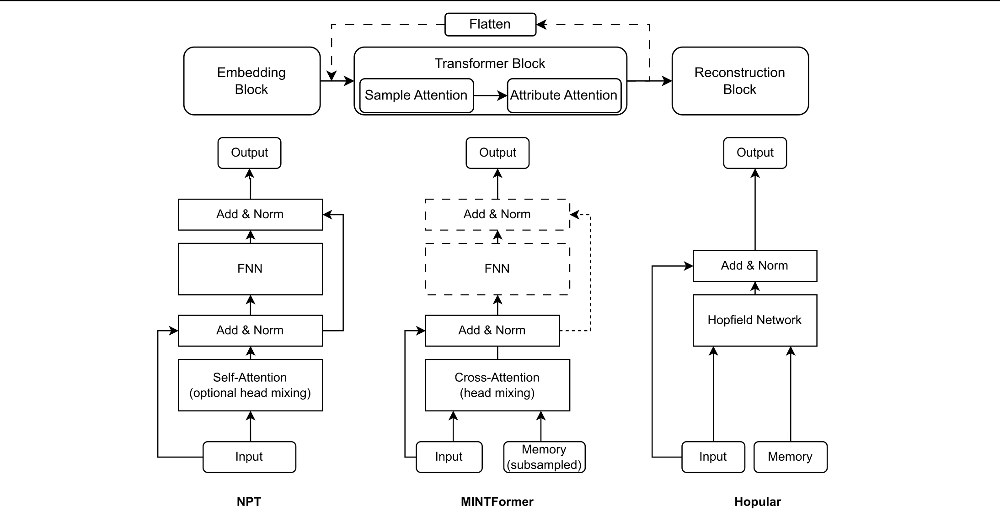

# MINTFormer
> *This repository is currently under development. The codebase and the associated documentation are not yet finalized and are subject to change.*

Memory Interaction Transformer (MINTFormer) is a deep learning architecture for tabular data based on NPT and Hopular.

The main idea of both NPT and Hopular is to go beyond the traditional parametric architectures and allow the model to rely on the available labeled data in addition to the weights. This can be thought of as having a memory that stores the training data and that can be accessed during inference for information retrieval.

<p align="center">
  
</p>

However, this approach has very limited scalability due to the quadratic complexity of the self-attention mechanism. To solve this problem, MINTFormer supports pluggable samplers that are aimed to compress the memory into a more compact representation through various pruning and distillation techniques.

Usage example: 
```python
from mintformer import MintDataLoader, MintDataset, MINTFormer
from mintformer_prep.samplers import RandomSampler #, IdentitySampler, NaiveClusterCentroidsSampler

# Prepare the dataset
# This config corresponds to a classification dataset with 2 categorical (0,1) and 2 numerical (2,3) features.
ds = MintDataset(data='data.csv', cat_ind=[0,1,5], target_ind=[5], **kwargs)
# 33% of the training dataset will be used as a fixed memory and sampled randomly
ds.prepare_memory(0.33, RandomSampler())
# Make a dataloader out of the dataset
dl = MintDataLoader(dataset=ds)
# Initialize the model; some of the required init arguments are provided by the dataset object
metadata = ds.model_init_kwargs
model = MINTFormer(**params, **metadata)
# Train the model
model.fit_dataloader(dl, **fit_kwargs)
```

Author: Oleh Kostromin

Supervisor: DI Gruber Lukas, MSc (JKU Linz)